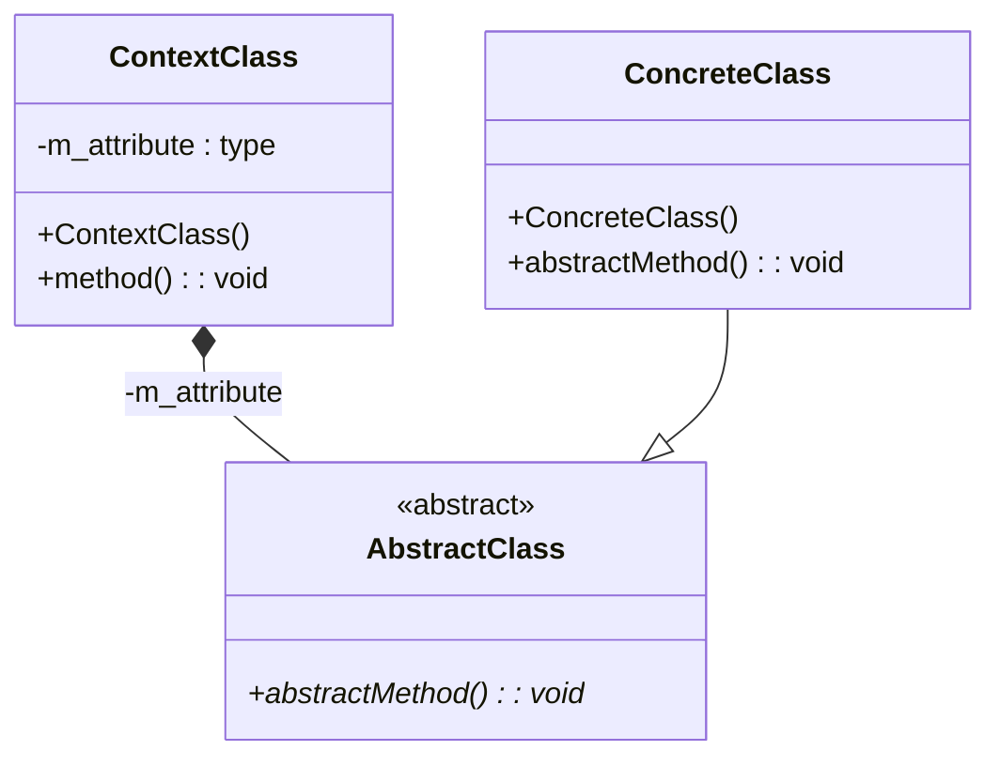

# UML Diagram Workflow

Follow these steps to create a UML class diagram for C++ code:

## 1. Analyze the Code Structure

- List all header files (.h) in the target folder
- Identify class hierarchies (inheritance relationships)
- Find composition/aggregation relationships (pointers, vectors)
- Note abstract classes (pure virtual methods `= 0`)

## 2. Extract Class Information

For each class, document:
- **Attributes**: Format as `-m_name : type` (private) or `+name : type` (public)
- **Methods**: Format as `+methodName(param : type) : returnType`
- **Abstract methods**: Add `*` suffix, e.g., `+calculate() : float*`
- **Constructors/Destructors**: Include with class name

## 3. Identify Relationships

| Symbol | Meaning | When to use |
|--------|---------|-------------|
| `*--` | Composition (plný diamant) | Object owns another, creates it in constructor |
| `o--` | Aggregation (prázdný diamant) | Object has reference but doesn't own |
| `--|>` | Inheritance | Class extends another |
| `..>` | Dependency | Uses temporarily |

## 4. Create Mermaid Diagram

Use this template:



## 5. Add Pattern Roles Table

Document which class plays which role in the design pattern:

```markdown
| Role | Class | Description |
|------|-------|-------------|
| Context | ClassName | Description |
| State/Command | ClassName | Description |
```

## Common Design Patterns

### State Pattern
- **Context**: Has pointer to State, can change states
- **State**: Abstract class with virtual methods
- **ConcreteState**: Implements state-specific behavior

### Command Pattern  
- **Invoker**: Stores and executes commands
- **Command**: Abstract class with execute method
- **ConcreteCommand**: Implements specific command

### Composite Pattern
- **Component**: Abstract interface
- **Leaf**: Individual objects
- **Composite**: Contains children components
